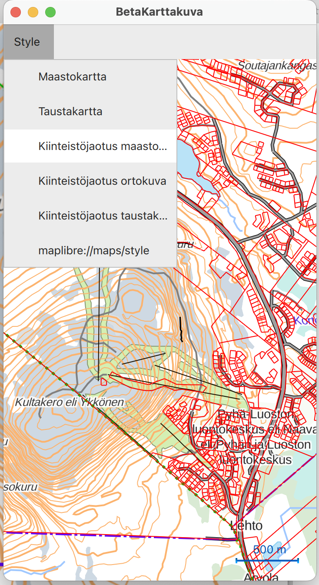

# beta-karttakuva-qt6-qtlocation-maplibregl

Proof-of-concept QtLocation Maplibre plugin with NLS of Finland vector tiles.

Qt6.6.0 with Qt6 qtlocation maplibgregl geoservices plugin is based on 
- https://github.com/qt/qtlocation dev branch
- https://bugreports.qt.io/browse/QTBUG-96795 info
- https://codereview.qt-project.org/c/qt/qtlocation/+/382087 gerrit fetch 

